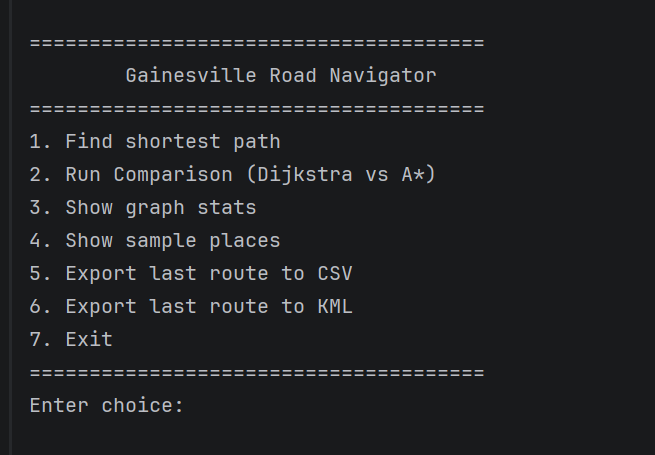
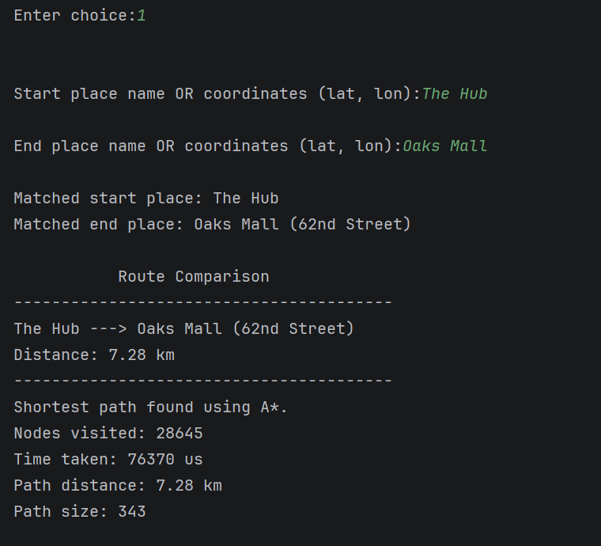
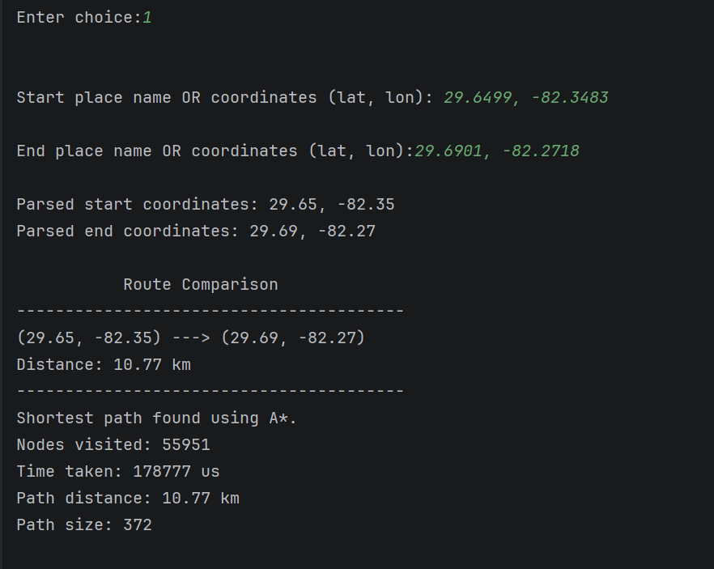
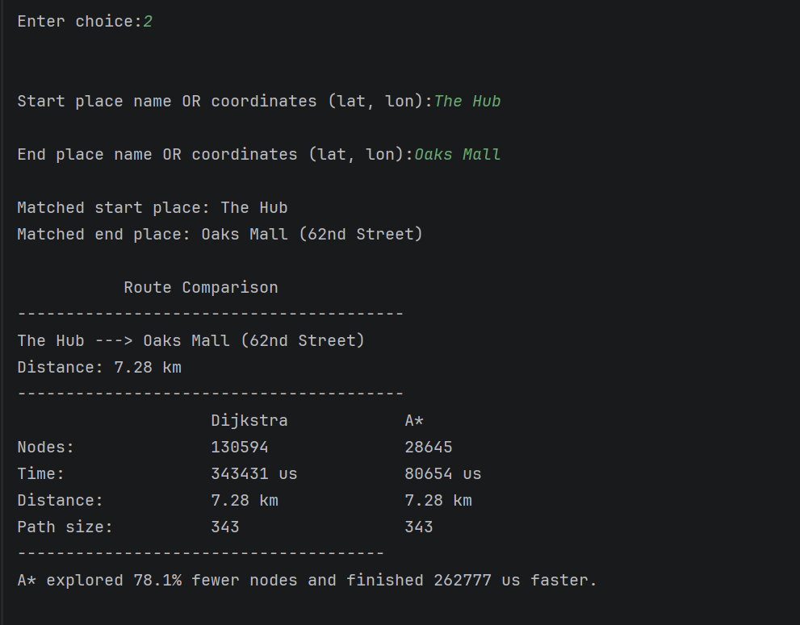
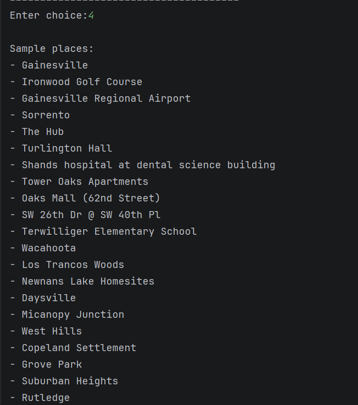
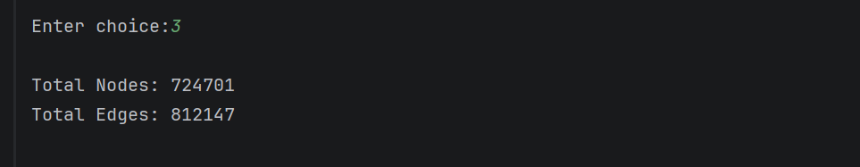
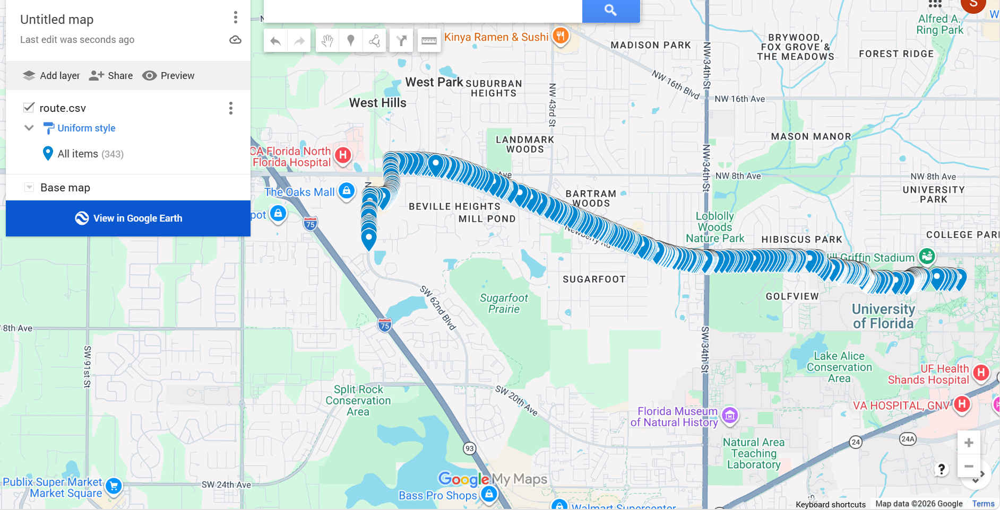
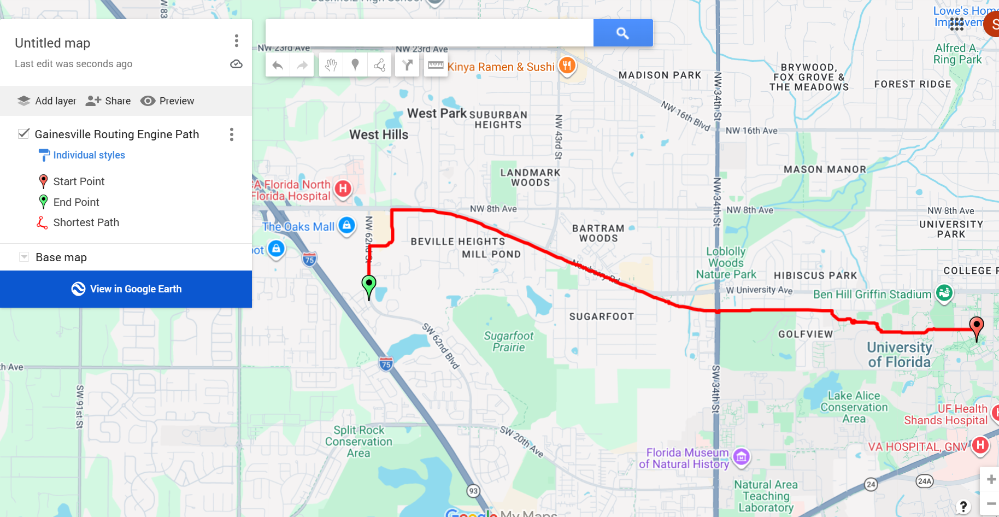

# Gainesville Road Navigator

# About the Project
This project is a road navigation system developed in C++ for Gainesville, Florida. It uses a real road network dataset 
to build a graph, where intersections are represented as nodes and roads are represented as edges. The system allows users
to search for routes using place names or GPS coordinates and computes the shortest path between two locations. The project 
implements both Dijkstra and A* algorithms and compares their performance in terms of running time and number of visited nodes.
The system can also export routes to CSV and KML files, allowing users to visualize the generated paths in Google My Maps.

# Main Features
- Finds shortest path between two locations
- Search using place names
- Search using coordinates (latitude, longitude)
- Compares Dijkstra and A* performance
- Displays graph statistics
- Shows sample Gainesville places
- Exports last route to CSV
- Exports last route to KML
- Visualizes routes in Google My Maps
- KD-Tree support for fast nearest-node search

# Requirements
- C++14 compatible compiler
- CMake 3.22 or newer

## Installation

```bash
git clone https://github.com/saimaakter885/Gainesville-road-navigator.git
cd Gainesville-road-navigator
```

# Building the Project
```bash
cmake -B build
cmake --build build
```
Run the executable inside the build directory.

Linux/macOS:
```bash
./GainesvilleRoadNavigator
```
Windows:
```bash
GainesvilleRoadNavigator.exe
```
# Important Note
The executable must be run from the build directory.
For our setup, this is usually:
```text
cmake-build-debug/
```
Do **NOT** run the executable from the project root directory, because the GeoJSON file may not be found.

# Program Menu
1. Find the shortest path
2. Run comparison (Dijkstra vs A*)
3. Show graph statistics
4. Show sample places
5. Export last route to CSV
6. Export last route to KML
7. Exit

## Example Outputs

### Main Menu


### Shortest Path Search
Users can search using place names:
```text
Start: The Hub
End: Oaks Mall
```
or GPS coordinates:

```text
Start: 29.6499, -82.3483
End: 29.6485, -82.3443
```



### Dijkstra vs A* Comparison
The program compares:

- Number of visited nodes
- Running time
- Path distance
- Path size


### Sample Places



### Graph Statistics



### Route Visualization

The exported KML and CSV file can be opened in Google My Maps.

To view the route:
1. Open Google My Maps.
2. Create a new map.
3. Select **Import**.
4. Upload the generated `route.csv` or `route.kml` file.
5. The computed shortest path will be displayed on the map.




# Contributors
- Saima Akter (saimaakter885)
- Stephen Horvat (Shmoney81)
